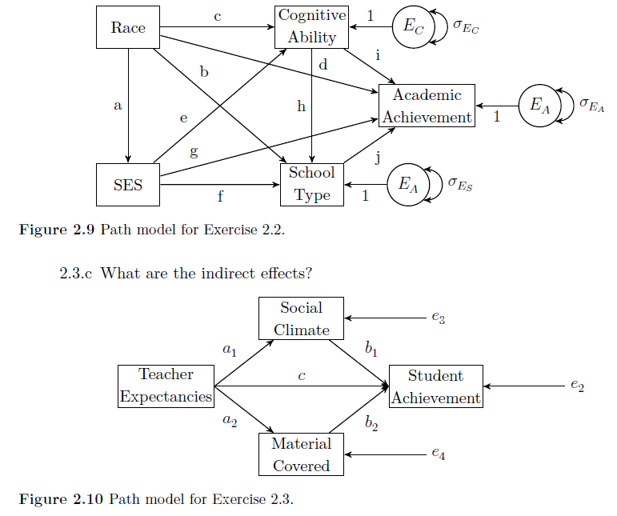

```{r, include = FALSE}
library("lavaan")
```
  
  
# Exercise 2.1

Get the file 'MathHmwk.txt' from Github and read it into **`R`**:

```{r}
Math.data <- read.table("MathHmwk.txt", header = TRUE)
```

The dataset contains 100 observations on two variables: (a) number of hours typically spent completing math homework (`MathHomework`), and (b) score on a standardized math achievement test (`MathAchievement`). The question of interest is: How does time spent on math homework affect math achievement?

a) Perform a linear regression analysis using the `lm()` function. Also compute the correlation coefficient between `MathHomework` and `MathAchievement` (remember that $r_{xy} = b_x \frac{s_x}{s_y}$).

b) Draw a standardized path model of the regression (in a standardized path model, the variables have a variance of one and a mean of zero; the means may therefore be omitted). 

c) Perform the same analysis in lavaan using the `sem()` function. Obtain both standardized and unstandardized path coefficients. What is the correlation between `MathHomework` and `MathAchievement`?

d) How are the results in part d) related to the results from part b)?
  


  
  
  
# Exercise 2.2

Page and Keith (1981) usea sample from the *1980 High School and Beyond* study to investigate the following question: What is the relationship between school type and academic achievement? The data are given below and a path model for the analysis is shown in Beaujean Figure 2.9.

```{r}
HighSchool.cor <- lav_matrix_lower2full(c(
  1.000,
  0.178, 1.000, 
  0.230, 0.327, 1.000,
  0.106, 0.245, 0.183, 1.000,
  0.195, 0.356, 0.721, 0.178, 1.000
))
rownames(HighSchool.cor) <- colnames(HighSchool.cor) <- 
  c("Race", "SES", "CognAb", "SchoolTy", "AcAch")
```

a) What are the endogenous and exogenous variables in the model in Figure 2.9? 

b) Fit the model as in Figure 2.9 using lavaan syntax.

c) Describe the association between school type and academic achievement.

d) What was the original, bivariate correlation between race and academic achievement?

e) What is the direct standardized effect of race on academic achievement in the model you fitted?

f) How does the SEM model 'explain' the difference between the answers on parts d) and e)?

g) Do you think Race 'causes' cognitive ability, school type and academic achievement?
  
  
```{r, fig=TRUE, echo=FALSE, out.width = '80%'}

```
  
# Exercise 2.3

MacKinnon (2008, p. 113) provides a dataset from a hypothetical study of teacher expectancies and student achievement. His path model is shown in Beaujean Figure 2.10 and the sample covariances are given below:

```{r}
MacKinnon.cov <- lav_matrix_lower2full(c(
  84.85, 
  71.28, 140.34, 
  18.83,  -6.25, 72.92, 
  60.05,  84.54, 37.18, 139.48
))
rownames(MacKinnon.cov) <- colnames(MacKinnon.cov) <- 
  c("TeachExp", "SocCli", "MatCov", "StudAch")
```

a) What are the endogenous and exogenous variables in the model in Figure 2.10? 

b) What is the original bivariate correlation between teacher expectancies and student achievement? Compute it from the covariance matrix given above, either by hand or using **`R`**.

c) Write the model in lavaan syntax. Use the `:=` operator to define both indirect effects from teacher expectancies to student achievement (a1×b1 and a2×b2). Fit the model to the data. What is the direct effect of teacher expectancies on student achievement? what are the indirect effects (i.e., through social climate and material covered)? According to the model, is the assocation between teacher expectancies and student achievement mediated by social climate and material covered?

d) Using the results of your analysis, write out the $\mathbf{\beta}$ and $\Psi$ matrices. (Hint: ignore the indirect paths, include only direct paths between variables.)


